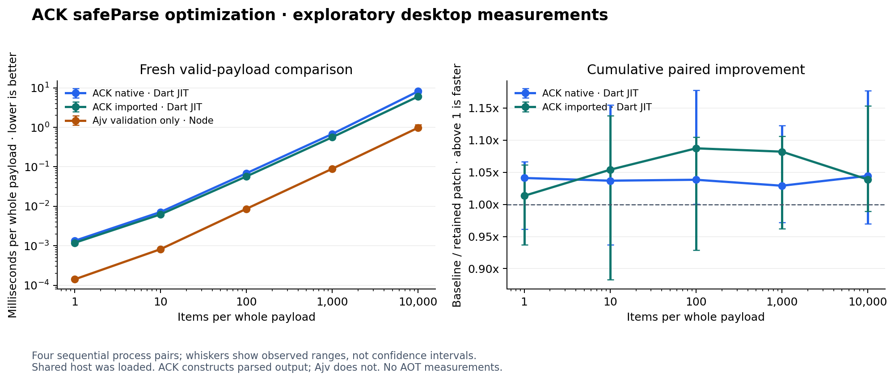

# ACK safeParse optimization execution

**Completed, 2026-10-08.** Tested and benchmarked four candidates separately:
retained lazy constraint-error storage and singleton imported-type dispatch;
rejected the property-entry cache and integer fast path. Final 10,000-item
paired ratios were **1.044x native** and **1.039x imported** versus the frozen
starting source. Results vary by workload; this is not a universal speedup.

**2,183 project tests passed**, with four opt-in live-service skips. Node
contracts and benchmark harness checks also passed. Fresh prepared parsing
took **8.145 ms native / 6.022 ms imported / 0.975 ms Ajv** at 10,000 items.
Ajv does not construct ACK's parsed output, so the remaining gap is not a
language-speed comparison. All new measurements are JIT/Node only.

This follows the [JIT audit](ACK%20JIT%20performance%20audit.md), preserving
its historical measurements. Changes are uncommitted and confined to this
workspace; no branch rename, push, or PR was performed.

## Scope and method

- Existing `safeParse` contract only. No validation-only API, AOT measurement,
  generator redesign, commit, push, or other-workspace edit.
- Start from PR #213 at `82d21b0d27a8ee6ac6c06b9843ffaad9f7b91c51`.
  Freeze uncommitted library source by hash for each candidate; compare with
  the immediately preceding **retained** candidate, not a historical timing.
- Run strict ACK analysis and the full ACK suite before timing each patch.
  Include meaningful lifecycle, subclass dispatch, numeric-platform, and
  imported-schema compatibility checks.
- Run baseline/candidate workers sequentially, alternating AB/BA ordering,
  with identical shuffled case order, corpus, workers, and dependency locks.
  Four pairs, seven samples, 300 ms warmup target, 75 ms timed-batch target.
  Independent focused confirmations use eight pairs, nine samples, 600 ms
  warmup and 100 ms batches; include unfavorable cases, not just winners.
- Every worker checks the complete acceptance/rejection/output/non-mutation
  corpus, even when timing is filtered. Raw samples, checksums, corpus and
  source hashes are preserved. Recalculate summaries and paired ratios from
  raw data. Do not trim outliers or retry failed/interrupted runs silently.
- Ratios are medians of within-pair baseline/current costs. Greater than one
  means faster. They are not ratios against the earlier audit, confidence
  intervals, individual-request percentiles, or production guarantees.

The shared Apple M2 Max (12 logical CPUs) was busy during the candidate
runs. Final-run load is recorded separately below. The unchanged-source
control itself produced an apparent **1.288x** gain in one cell, despite
identical ACK hashes. Favor repeated direction over one favorable result;
still treat these as exploratory measurements. No bytes/op measurement is
claimed: the audited VM heap counters do not measure cumulative allocation.

## Candidate decisions

### 1. Lazy constraint-error storage — retained

Allocate the shared constraint-error list only after the first violation.
Preserve full evaluation, diagnostic ordering, exception precedence, callback
count, and refinement behavior. There is no shared mutable error buffer.

Strict analysis and 1,397 ACK tests passed. Independent confirmation reduced
the initial apparent effect sizes; the repeated direction was modest:

| Workload | Initial paired ratio | Confirmation | Faster pairs |
|---|---:|---:|---:|
| String valid | 0.955x | 1.000x | 4/8 |
| String constraint rejection | 0.848x | 1.010x | 5/8 |
| Flat valid | 1.001x | 1.047x | 6/8 |
| Flat construction + parse | 0.926x | 1.015x | 4/8 |
| 500 valid items | 1.290x | 1.050x | 6/8 |
| 1,000 valid items | 0.972x | 1.032x | 5/8 |
| 10,000 valid items | 1.105x | 1.053x | 6/8 |
| 10,000 all-invalid items | 1.017x | 1.056x | 5/8 |
| 10,000 decode + parse | 1.081x | 1.093x | 6/8 |

The initial small-input/construction regressions did not repeat. Retained for
the repeated modest large-payload direction; eliminating a source-level list
construction does not establish a measured allocation-byte reduction.

### 2. Immutable property-entry cache — rejected

First audit direct result matching: `Ok` and `Fail` are public, subclassable,
and have overridable methods. Replacing `.match` with structural matching
would bypass observable subclass behavior. Keep the existing dispatch; add a
compatibility test rather than making that unsafe replacement.

Trial a lazy cache of the immutable property entries instead. Strict analysis
and 1,399 tests passed; order, error paths, and dispatch remained unchanged.

| Workload | Initial paired ratio | Confirmation | Faster pairs |
|---|---:|---:|---:|
| Flat numeric-string rejection | 0.855x | 0.964x | 0/8 |
| Flat valid | 1.017x | 0.994x | 3/8 |
| Flat construction + parse | 1.021x | 1.004x | 6/8 |
| 1,000 valid items | 1.097x | 1.078x | 7/8 |
| 10,000 valid items | 1.114x | 1.129x | 8/8 |
| 10,000 all-invalid items | 1.096x | 0.997x | 4/8 |
| 10,000 decode + parse | 1.103x | 1.211x | 7/8 |

This is an observed tradeoff, not an across-the-board win. Numeric-string
rejection was slower in both experiments and all eight confirmation pairs;
the cache also retains additional per-used-schema memory. Under the plan's
no-repeatable-regression criterion, leave it out of this general-purpose
patch. Preserve the tests, candidate source, and unfavorable results.

### 3. Native integer fast path — rejected

Finite native integers bypass fractional and lossless-conversion checks.
Keep the finite guard because JavaScript-backed Dart integers can include
infinities, and normalize negative zero before constraints/refinements.
Integral-double conversion retains the existing BigInt loss check.

New numeric-contract checks passed before editing on VM (12) and Node (11,
one platform-specific skip). After editing, Node has the same result; strict
analysis and all 1,400 ACK tests passed.

| Workload | Initial paired ratio | Confirmation | Faster pairs |
|---|---:|---:|---:|
| Flat valid | 1.088x | 1.006x | 4/8 |
| Flat mixed | 1.070x | 1.001x | 4/8 |
| Flat construction + parse | 1.072x | 0.985x | 4/8 |
| 500 valid items | 0.937x | 1.023x | 4/8 |
| 50 all-invalid items | 0.950x | 0.956x | 3/8 |
| 10,000 valid items | 1.013x | 0.941x | 2/8 |
| 10,000 all-invalid items | 1.017x | 0.977x | 3/8 |
| 10,000 decode + parse | 0.999x | 1.040x | 5/8 |

The initial favorable flat-input results did not repeat. The unchanged string
path also shifted, underscoring host/process variability. There is no
reproducible overall benefit to justify this extra branch; restore the
original implementation, retain the stronger platform contract tests, and
preserve the unsuccessful candidate. Confirmation scaling load rose from
13.72 to 20.23 on the 12-CPU host; do not interpret these magnitudes as stable
production regressions either.

### 4. Singleton imported-type check — retained

Directly test the common one-element `type` list. Keep the existing `any`
evaluation for unions, JSON safety/copy ordering, diagnostic paths, and
recursive immutable snapshot behavior. Before and after: three new imported
contract tests pass on Node; before editing they also pass on VM. Strict
analysis and all 1,403 ACK tests pass.

| Workload | Initial paired ratio | Confirmation | Faster pairs |
|---|---:|---:|---:|
| String valid | 1.047x | 1.039x | 6/8 |
| String construction + parse | 0.936x | 1.003x | 5/8 |
| Flat missing field | 0.982x | 1.007x | 5/8 |
| Flat valid | 1.074x | 1.058x | 8/8 |
| Flat construction + parse | 1.078x | 1.003x | 4/8 |
| 500 valid items | 1.132x | 1.083x | 8/8 |
| 1,000 valid items | 1.055x | 1.023x | 7/8 |
| 10,000 valid items | 1.059x | 1.054x | 8/8 |
| 10,000 all-invalid items | 0.980x | 1.000x | 4/8 |
| 10,000 decode + parse | 1.109x | 1.072x | 8/8 |

The valid-input benefit repeated; suspected construction and all-invalid
regressions did not. No confirmation cell exceeded the harness's descriptive
20% fork-spread flag. Retained, without asserting statistical significance
or allocation savings. Final integration/cumulative measurements follow.

## Final integration and cumulative comparison

All four candidate decisions, integration checks, and the fresh cumulative
comparison are complete. The final native regression confirmation also
completed; the suspected mixed/error/construction slowdowns did not repeat
materially, supporting the two retained changes.

**2,183 project tests passed; four opt-in live Firebase tests were skipped.**
All six workspace packages passed strict analysis. ACK's full 1,403-test run
and analysis were reused from candidate 4 because its source hash and test
code are unchanged; other final scopes ran serially after timing finished.

| Scope | Passed | Skipped |
|---|---:|---:|
| ACK | 1,403 | 0 |
| Root release/tooling tests | 60 | 0 |
| JSON Schema builder | 52 | 0 |
| MCP adapter | 63 | 0 |
| Examples | 113 | 0 |
| Flutter/Firebase adapter | 98 | 4 opt-in live tests |
| Full generator suite | 394 | 0 |

Additional verification: Node contracts **21 passed, one expected
platform-specific skip**; Python benchmark harness **26 passed**; strict
benchmark analysis, Node syntax, and diff checks passed.

The generator suite ran alone with concurrency 1 and an explicit two-minute
test timeout. Both historical timeout cases passed in this fresh full run.
That result does not erase the original timeouts or prove their cause.
See [final verification logs](../.context/safeparse-optimization/final-checks/REPORT.md).

### Fresh cumulative JIT/Node comparison

The final run compares the two retained changes with the frozen starting
source from PR #213. Competitor versions are measured freshly in the same
run, not copied from an older report. Four AB/BA pairs, seven samples per
case, 300 ms warmup and 75 ms timed-batch targets; no concurrent tests or
profiles were started by this task. Other workloads remained on the host.

Environment: **Apple M2 Max**, Dart SDK version: 3.13.4 (stable) (Tue Sep 15 01:01:15 2026 -0700) on "macos_arm64",
Node **v26.4.0**. Workload timings are medians of process
batch-average costs, not individual-request latency percentiles.

- Common: one-minute load 7.57 → 9.93; 8/207 cells exceed 20% fork spread.
- Scaling: one-minute load 9.93 → 10.76; 7/125 cells exceed 20% fork spread.

**Cumulative ACK comparison — valid prepared payloads.** Times are
milliseconds per whole payload. Paired ratios above 1 mean faster.

| Items | ACK mode | Baseline ms | Retained ms | Paired ratio | Faster pairs |
|---:|---|---:|---:|---:|---:|
| 1 | Native | 0.0013 | 0.0013 | 1.041x | 3/4 |
| 1 | Imported | 0.0012 | 0.0012 | 1.013x | 3/4 |
| 10 | Native | 0.0074 | 0.0072 | 1.037x | 3/4 |
| 10 | Imported | 0.0066 | 0.0062 | 1.054x | 3/4 |
| 100 | Native | 0.0704 | 0.0684 | 1.038x | 4/4 |
| 100 | Imported | 0.0610 | 0.0570 | 1.087x | 3/4 |
| 1,000 | Native | 0.7054 | 0.6778 | 1.029x | 2/4 |
| 1,000 | Imported | 0.6024 | 0.5608 | 1.082x | 3/4 |
| 10,000 | Native | 8.5628 | 8.1449 | 1.044x | 3/4 |
| 10,000 | Imported | 6.4304 | 6.0216 | 1.039x | 3/4 |

**Unfavorable common cells were checked again.** An independent
eight-pair native confirmation used longer warmups and included controls
and the slower cases from the full matrix. Results are not substituted
into the original matrix or pooled to hide an unfavorable run.

| Native workload | Full-run paired ratio | Confirmation ratio | Faster confirmation pairs |
|---|---:|---:|---:|
| flat-invalid-many | 0.961x | 1.018x | 5/8 |
| flat-mixed | 0.971x | 1.023x | 7/8 |
| flat-valid | 1.015x | 1.006x | 5/8 |
| flat-valid/construct+validate | 0.970x | 0.995x | 3/8 |
| nested-500-valid | 1.014x | 1.023x | 7/8 |
| string-invalid-type | 0.966x | 1.003x | 4/8 |

[Native confirmation: raw pairs and ranges](../.context/safeparse-optimization/final-native-confirmation/common/comparison.md).

Mixed inputs and 500-item valid parsing were faster in 7/8 confirmation
pairs; multi-error and wrong-type results were approximately neutral. The
construction ratio of 0.995x is also near neutral, not evidence of a broad
construction improvement. This supports retaining the lazy list while
keeping the earlier unfavorable run visible.

The full scaling matrix also has adverse/no-improvement rows: imported
10,000 all-invalid **0.946x**
(2/4 faster), and native
10,000 decode + parse **0.990x**
(2/4 faster). The earlier eight-pair
singleton confirmation measured all-invalid at 1.000x (4/8 faster).
Do not claim every case became faster; complete unfavorable rows remain
in the reports and CSV, alongside favorable ones.

**Fresh package context — microseconds per whole payload.** Construction
includes schema preparation plus one parse/validation, and Ajv includes
uncached compiler creation. It is not a cold-process startup metric.

| Package | Category | Flat valid µs | 500 valid µs | Flat construction + call µs |
|---|---|---:|---:|---:|
| ACK native | Parser | 1.368 | 327.272 | 4.164 |
| ACK imported | Parser | 1.067 | 259.429 | 13.769 |
| Validart 3.0.2 | Parser | 1.772 | 421.412 | 2.487 |
| Zod 4.6.5 | Parser | 0.896 | 165.623 | 77.681 |
| Valibot 1.5.0 | Parser | 0.501 | 137.149 | 1.935 |
| Dart json_schema 5.2.2 | Validator | 1.361 | 358.202 | 158.406 |
| Ajv 8.20.0 | Validator | 0.178 | 46.941 | 2197.439 |

Acanthis 2.0.0 remains excluded after its prior wrong-type correctness
probe failed to terminate; no new timing or ranking is claimed for it.

**10,000-item context — milliseconds per whole payload.**

| Operation | ACK native | ACK imported | Ajv |
|---|---:|---:|---:|
| Prepared valid call | 8.145 | 6.022 | 0.975 |
| Decode + valid call | 12.443 | 9.572 | 2.397 |

The observed large-valid gap is still **8.4x** for native ACK
and **6.2x** for imported ACK relative to Ajv. These compare
different API/execution contracts: ACK constructs parsed output; Ajv
validates without doing that work. They are not Dart-versus-JavaScript
language-speed ratios. Invalid cases are also not an equivalent
all-errors ranking; see all rows in the linked reports.

[Figure PDF](assets/safeparse-jit-scaling.pdf) ·
[Every paired candidate/control result, CSV](assets/safeparse-paired-results.csv) ·
[Every final package cell, CSV](assets/safeparse-final-comparison.csv)

Full unfiltered reports:

- [Common package matrix](../.context/safeparse-optimization/final-comparison/common/report.md)
  and [paired ACK results](../.context/safeparse-optimization/final-comparison/common/comparison.md).
- [Scaling matrix](../.context/safeparse-optimization/final-comparison/scaling/report.md)
  and [paired ACK results](../.context/safeparse-optimization/final-comparison/scaling/comparison.md).

Source identity:

- Baseline ACK: `371506aab474a021b763ef5589b20379a5ef56b03c4dcaf322cec220eb06a2d5`.
- Retained ACK: `c3f1e13ba7c00050a94d569d3613c7d722d126208e8dd6d0497e041d6841422e`.

The final full matrix contains 332 cells and 9,296 timed batches, with
41,550 recorded validity assertions across preflight and timed workers.
The additional native confirmation has 864 batches and 14,400 validity
assertions. These are benchmark checks, not additional project unit tests.
All source/corpus/lock identities and recomputed raw statistics passed.

## What the implementation evidence explains

The retained library diff is intentionally small:

| Path | Redundant work removed | Behavior retained |
|---|---|---|
| [Shared constraint helper](../packages/ack/lib/src/schemas/schema.dart) | Eager creation of an empty constraint-error list | All constraints, exception precedence, diagnostic order, and refinement count |
| [Imported evaluator](../packages/ack/lib/src/schemas/imported_json_schema.dart) | Generic list predicate dispatch for singleton types | Union matching, JSON safety, snapshot ownership, null/numeric semantics, and keyword locations |

These are source-level explanations, not measured byte or CPU percentages.
The JIT may eliminate some intermediates already. The integer experiment is
an example of why fewer-looking checks do not guarantee faster full parsing:
its apparent small-input gains disappeared on repetition. No deoptimization
trace was collected to establish the cause of its timing shifts.

The cache experiment did reduce repeated entry traversal work in source, but
also retained schema-local storage and had a repeated adverse small-input
measurement. Rejecting it does not mean caching can never help; it means the
observed tradeoff did not meet this patch's acceptance criterion.

None of these changes removes ACK's required output construction or the
imported parser's JSON-safe detached snapshot. Ajv's specialized generated
validator still performs different work. A future quiet-host study of
full-parse specialization, schema churn, and output/error retention would be
separate work—not an unimplemented part of these four candidates.

## Evidence index

All execution artifacts are under
[`.context/safeparse-optimization`](../.context/safeparse-optimization/).
Each completed timing directory contains `results.json`, raw batches,
`report.md`, `comparison.md`, and an independent `integrity-check.json`.
Every candidate snapshot includes the ACK library and package manifest.

- [Authorized plan](../benchmarks/PLAN.md#authorized-safeparse-optimization-execution)
- [Decision log](../.context/safeparse-optimization/DECISIONS.md)
- [Identical-source control](../.context/safeparse-optimization/00-control/comparison.md)
- [Candidate 1 common](../.context/safeparse-optimization/01-lazy-constraints/common/comparison.md)
  and [scaling](../.context/safeparse-optimization/01-lazy-constraints/scaling/comparison.md)
- [Candidate 1 confirmation](../.context/safeparse-optimization/01-confirmation/)
- [Candidate 2 common](../.context/safeparse-optimization/02-property-entries-fixed/common/comparison.md)
  and [scaling](../.context/safeparse-optimization/02-property-entries-fixed/scaling/comparison.md)
- [Candidate 2 confirmation](../.context/safeparse-optimization/02-confirmation/)
- [Candidate 3 execution](../.context/safeparse-optimization/03-integer-fast-path/)
- [Candidate 3 confirmation](../.context/safeparse-optimization/03-confirmation/)
- [Candidate 4 execution](../.context/safeparse-optimization/04-singleton-type/)
- [Candidate 4 confirmation](../.context/safeparse-optimization/04-confirmation/)

Earlier analyzer setup failures remain in their original directories; the
subsequent fixed runs are explicitly labeled. No externally stopped test was
restarted. The historical full project run's two generator timeouts and later
isolated passes remain recorded separately; they are not relabeled as a
fully green original run.
